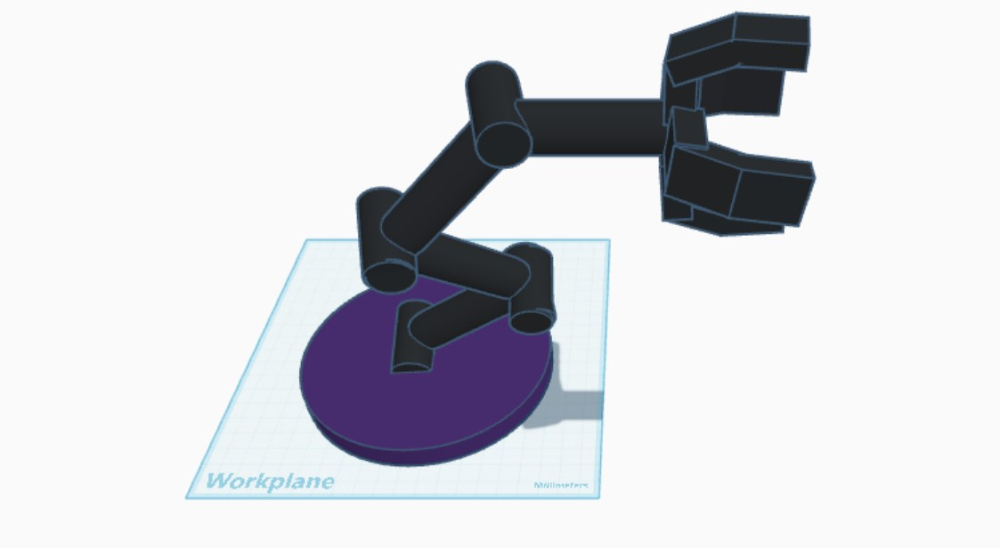

# ذراع روبوتية ثلاثية الابعاد - مكونه من 5 درجات (باستخدام الTinkerCAD)

## وصف المشروع 
ذراع روبوتية ثلاثية الابعاد مكونه من 5 درجات حريه باستخدام منصه الTinkerCAD، تم تنفيذ التصميم ضمن مسار الميكانيكا ويهدف إلى فهم المفاصل المتحركة في الروبوتات.

## الأدوات المستخدمة
- منصه TinkerCAD (تصميم ثلاثي الأبعاد)
- أشكال : Cylinder, Box
- أدوات : Align, Rotate, Group

## درجات الحرية (Degrees of Freedom) 
1. دوران القاعدة (Base Rotation)
2. حركة الذراع السفلى لأعلى و أسفل
3. حركة الذراع العلوية لأعلى و أسفل
4. حركة الرسغ (Wrist)
5. حركة أو تدوير القبضة (Gripper)

## خطوات التصميم
1. تصميم القاعدة باستخدام اسطوانة، والذي يعتبر هو الجزء الأساسي الذي يحمل الذراع.
2. الذراع السفلى باستخدام صندوق.
3. الذراع العلوية فوقها مع مراعاة المحاذاة بين الاجزاء.
4. إضافة الرسغ والمفاصل حسب الدرجات المتبقية، لتحقيق حركة مرنه تشبه الذراع الحقيقية.
5. محاذاة وتجميع كل الأجزاء بدقة باستخدام أداة Align ، لضبط التوازن بين جميع الأجزاء.

## صورة لتصميم الذراع

## المصممة
تم التصميم بواسطه فاطمه ضمن مسار الميكانيكا

